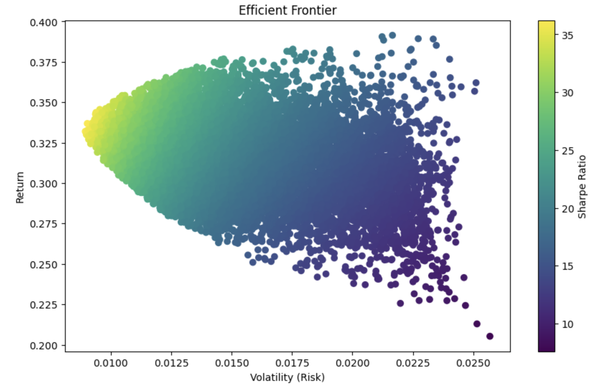

# Efficient Frontier Visualization

This project demonstrates the visualization of the efficient frontier using Python. The code calculates and plots the efficient frontier for a portfolio of assets, highlighting key metrics like returns, risks, and Sharpe ratios.

## Features
- Simulates portfolio data to compute the efficient frontier.
- Highlights optimal portfolios based on the Sharpe ratio.
- Fully customizable to include various asset combinations.

## Prerequisites
Ensure you have the following Python libraries installed:
```bash
pip install numpy pandas matplotlib
```

## Usage
1. Run the script in your Python environment.
2. Ensure you have the required dataset in the specified format.
3. The script generates a plot showcasing the efficient frontier.

## Output
The script produces a visualization similar to the one below:


